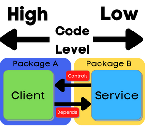
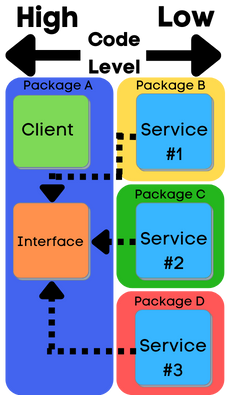
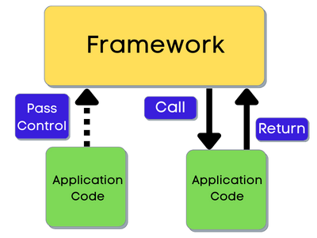

# Dependency Injection, Dependency Inversion, and the Inversion of Control

<h2 style="text-align: center;">Unwrapping the Mess</h2>

In my experience, most developers first experience with DI in Java is often with one of the big IoC
frameworks. These frameworks are really an amalgamation of several related techniques, principles,
features, etc. This can often obfuscate what, at its root, is a fairly simple concept to wrap your
head around, or even implement yourself. So, let's try to untangle some of these principles, and in
the process, examine their benefits.

`Dependency injection` is a __design pattern__ in which what a class *needs* is separated from what
it *does*. Without `Dependency Injection`, classes are typically responsible for creating the
Objects they need to perform a business function.

  

With `Dependency Injection`, instead of creating their dependencies internally, Classes accept them
as formal parameters (_constructor, setters, properties_). It can be implemented with just two
steps:

1. Writing classes that accept their dependencies as parameters via constructor, setter, etc, and
2. Managing the creation, passing around (injection), and general life cycle of said dependencies
   somewhere else (as simple as the first few lines of your main method...)

The abstraction responsible for handling the creation of these composed components is typically
referred to as the `Injector`.

  

There are other design patterns, such as the `Service Locator` pattern, which are implementations
of `Inversion of Control`.

The main difference is that when using `Dependency Inection` you end up with an `Injector` with a
dependency on every Class, and when using a `Service Locator` you end up with every Class having a
dependency on the `Locator`.

<h3 style="text-align: center;">Benefits of Dependency Injection:</h3>

1. Declarative Classes - When all of your classes declare their needs/dependencies right up there at
   the top, your code becomes much easier to reason about.

  

2. Easier Testing - We have much better control over isolating the behavior of our class we want to
   test, because we can now mock/stub all the dependencies and completely control their behavior.

  

3. Reduced coupling - Changes to the way a dependency is created / obtained no longer require
   changes in every class that uses it, since we've abstracted the creation of that dependency to
   somewhere higher up the food chain.

4. Reduced Dependency Carrying - Often an Objects dependencies are passed down through a long chain
   of other Objects that have no awareness or need for them other than for the eventual creation of
   this Object. Dependency Injection allows us to eliminate these chains.

  

---

The job of the programmer in some sense is the building, wiring, and layering of low level
components with high level business or policy modules to accomplish a set goal.
With `Dependency Inversion` we aim to get the absolute most out of these individual components we
write.

`Dependency inversion` is a __design principle__ which asserts that higher level 'modules' should
not depend on low lower level 'modules'. That is, we should aim to reduce coupling between classes
and their dependencies.

Take a look at a simple example of `Client` and `Service` Classes.

  

When the higher level `Client` Class depends directly upon the `Service` class, it's re-usability
and extensibility are extremely limited. It's also important to consider what flows in the opposite
direction as dependency, which is control. I don't mean control in the IoC sense on the scope of an
application, but control at the level of individual components. Changes made in a dependent class
must be _enforced_ on those that depend upon it. This enforcement, I consider to be a certain type
of control.

Let's invert the direction of the dependency and examine the results.

We accomplish this (_at least in Java_) through the use of interfaces (_abstractions_). It's a shift
in thinking as much as it is a shift in coding. We focus not on the 'things' our classes need, but
instead on the 'behaviours' they need.

  

Now we can see that *Package A _imports nothing_ from Package B*. We can say that *Package A and the
classes within are no longer dependent on anything from Package B*. The direction of dependency has
been reversed. Multiple other low level packages are free to implement the Service interface from
Package A with different details, thus we have increased the *extensibility* of our Service. Our
Client from Package A can be used generically with different Service implementations, thus we have
increased the *re-usability* of our Client.

The higher level class is exposing it's required behaviours. Instead of hiring someone directly, it
just puts an advertisements out, available for any lower level components who wish to wise to the
challenge.

<h3 style="text-align: center;">Benefits of Dependency Inversion:</h3>

1. Robust Code - Loosely coupled components aren't as brittle and are less prone to breaking.

  

2. Extensibility / Flexibility - We can easily add, remove, and change the specific implementations
   of dependencies without updating the classes that use them.

  

3. Faster Development - Multiple teams can agree on high level interfaces at the beginning of a
   project, then dependent classes can be developed simultaneously

  

---

Inversion of Control is a design principle.

Inversion of Control is the defining characteristic of a `Framework`, and what distinguishes it from
a typical code `Library`. In a typical application, `Libraries` are used for their predefined
functions/abstractions. The important thing is that the Application code *Calls* the Library code.

  

Inversion of control is about reversing that, so that our *Framework* code calls the Application
code. Since control obviously originates in the `main` method of our program, there is typically a
very thin hand-off point at the very start of our program where control is forfeited/passed
(*SpringApplication.run()...*)

  

<h3 style="text-align: center;">Benefits of Inversion of Control:</h3>

1.

2.

3.

---

<h2 style="text-align: center;">Putting It All Together</h2>

So now that we know what Dependency Injection / Dependency inversion are, and how to implement them,
the million dollar question becomes... Why should we? Other than adhering to design principles that
you read in a book somewhere, what are the tangible, practical benefits for the developer?

With these definitions, you can see how dependency injection alone is not sufficient to achieve
dependency inversion.

  

