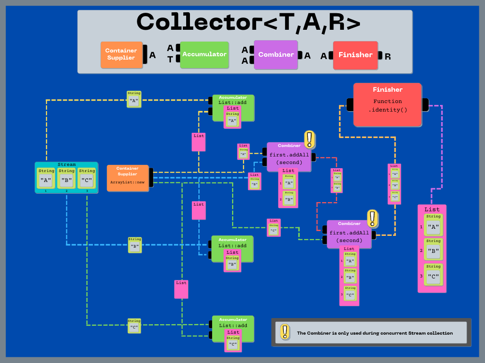
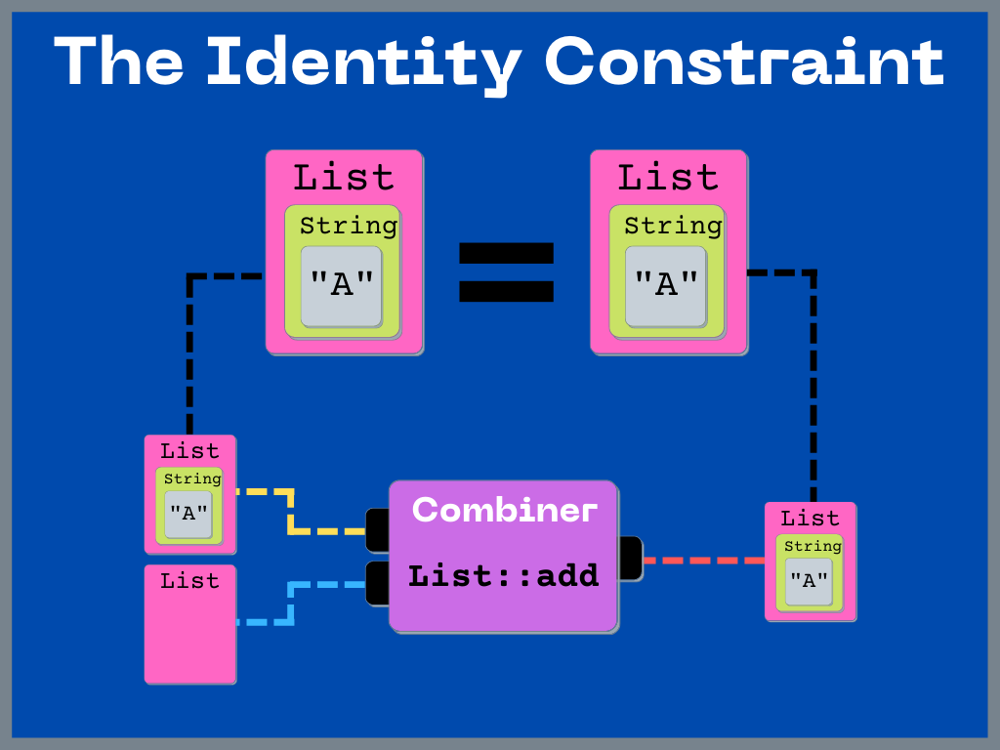
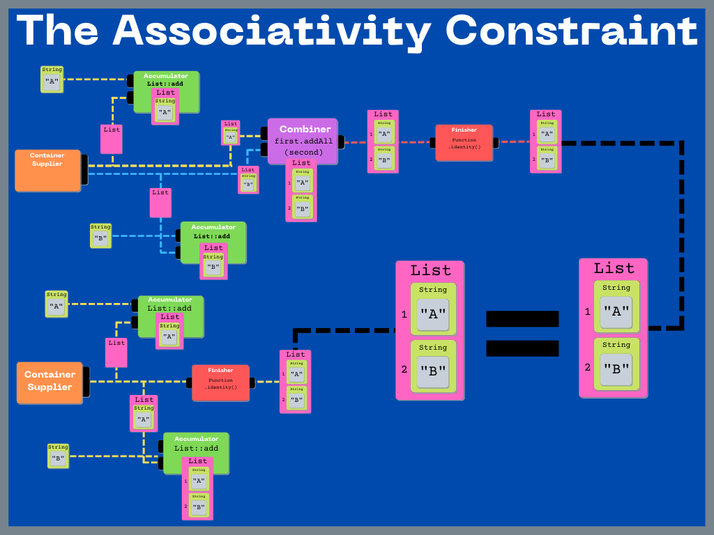
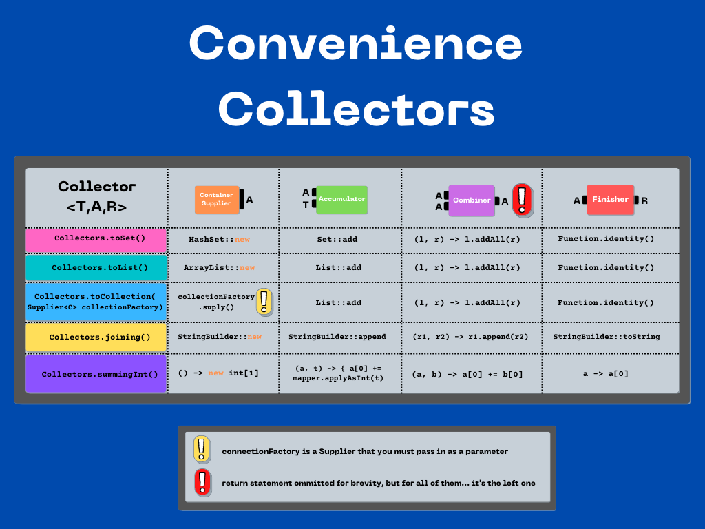

# Java 8 Collector

---

## 1.0 Overview:

`Collector` represents a special reduction operation using a mutable container. Elements are
incorporated by updating the state of this mutable container, rather than by replacing the result.
This is desirable behavior when we want to reduce a Stream into some sort of `Collection`. It would
be very inefficient to create a new `Collection` Object during every step of the reduction (*as is
typical in reduction operations*), so we can use `Collector` to avoid that.

## 1.1 Visualize it

Let's breakdown a simple Stream collection process to help understand the different components.


<br></br>
---

## 1.2 What Are The Rules?

> To ensure that sequential and parallel executions produce equivalent results, the collector functions must satisfy an identity and an associativity constraints.
> -- <cite>JavaDoc</cite>

Essentially, there are two things that must hold true in order for a Collector to perform
equivalently during parallel and sequential execution.

### The Identity Constraint

> The identity constraint says that for any partially accumulated result, combining it with an empty result container must produce an equivalent result. That is, for a partially accumulated result a that is the result of any series of accumulator and combiner invocations, a must be equivalent to
> ```java
> combiner.apply(a, supplier.get())
> ```
> -- <cite>JavaDoc</cite>



### The Associativity Constraint

> The associativity constraint says that splitting the computation must produce an equivalent result. That is, for any input elements t1 and t2, the results r1 and r2 in the computation below must be equivalent:
> ```java
> A a1 = supplier.get();
> accumulator.accept(a1, t1);
> accumulator.accept(a1, t2);
> R r1 = finisher.apply(a1);  // result without splitting
>
> A a2 = supplier.get();
> accumulator.accept(a2, t1);
> A a3 = supplier.get();
> accumulator.accept(a3, t2);
> R r2 = finisher.apply(combiner.apply(a2, a3));  // result with splitting
> ```
> -- <cite>JavaDoc</cite>



<br></br>

---

## 1.3 Some Examples:

### JDK Convenience Collectors



### 1.3.2 Build Your Own

