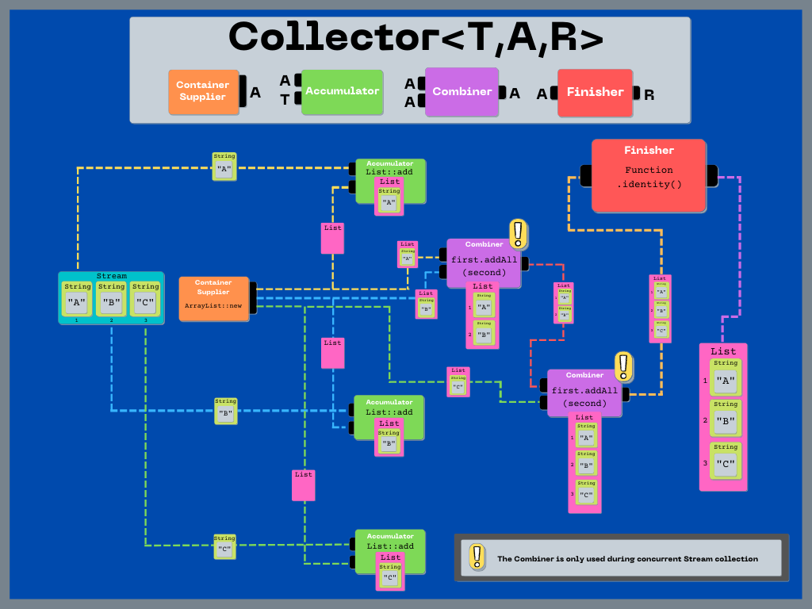
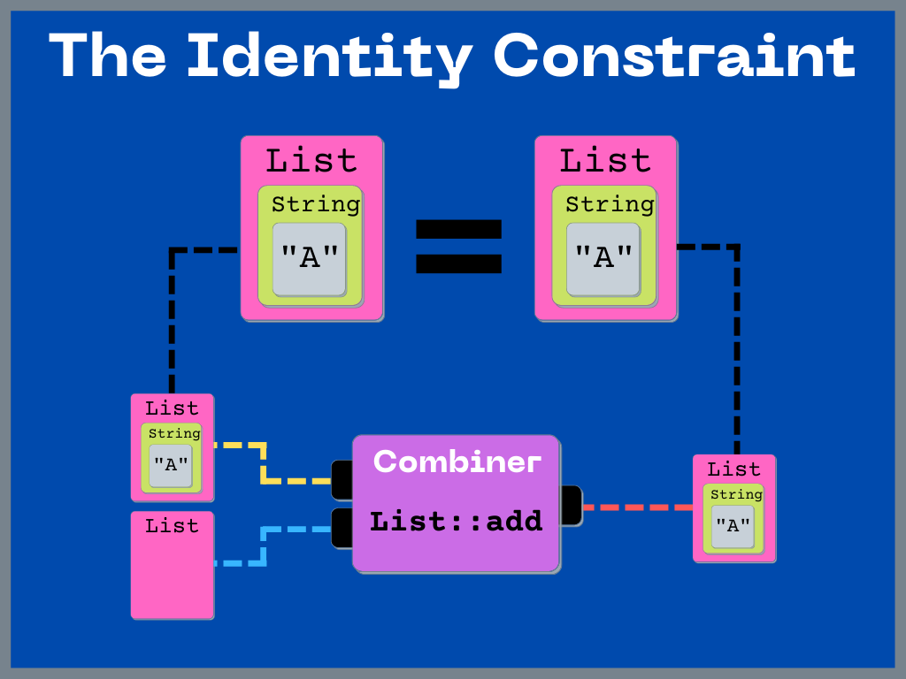
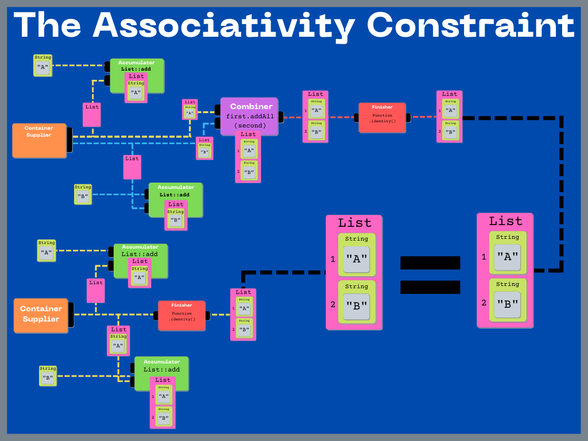
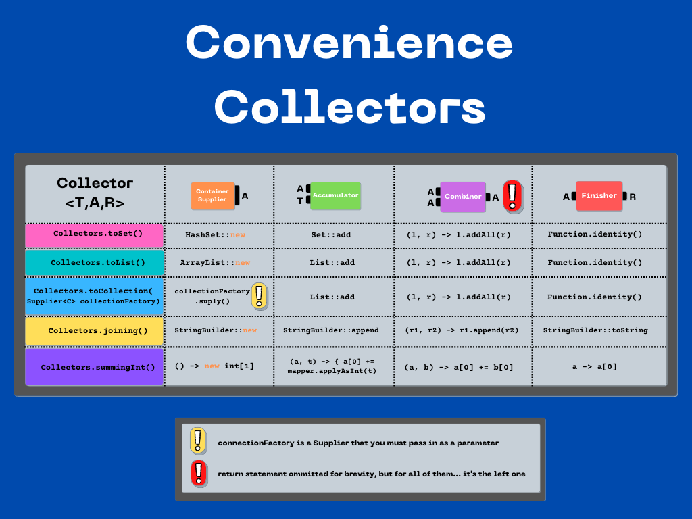

# Java 8 Collector

---

## Collector Overview:

`Collector` represents a special mutable reduction operation. Elements are incorporated by updating
the state of a mutable container rather than by replacing the intermediate result. This is desirable
behavior when we want to reduce a Stream into some sort of `Collection`. It would be very
inefficient to create a new `Collection` Object during every step of the reduction (*as is typical
in reduction operations*), so we can use `Collector` to avoid that. We'll dive deeper into  
*collection* vs *reduction* in a separate tutorial. For now, let's take a look at the pieces that
make up a `Collector`.

<h3 style="text-align: center;">Container Supplier</h3>

Creates a new mutable result container


<h3 style="text-align: center;">Accumulator</h3>

Incorporates data elements into the result container


<h3 style="text-align: center;">Combiner</h3>

Combines two result containers


<h3 style="text-align: center;">Finisher</h3>

Performs optional final transformation


---

## A Visual Breakdown

Let's breakdown a simple Stream collection process to help understand the different components.



---

## 1.2 What Are The Rules?

> To ensure that sequential and parallel executions produce equivalent results, the collector functions must satisfy an identity and an associativity constraints.
> -- <cite>JavaDoc</cite>

Essentially, there are two things that must hold true in order for a Collector to perform
equivalently during parallel and sequential execution.

### The Identity Constraint

> The identity constraint says that for any partially accumulated result, combining it with an empty result container must produce an equivalent result. That is, for a partially accumulated result a that is the result of any series of accumulator and combiner invocations, a must be equivalent to
> ```java
> combiner.apply(a, supplier.get())
> ```
> -- <cite>JavaDoc</cite>



### The Associativity Constraint

> The associativity constraint says that splitting the computation must produce an equivalent result. That is, for any input elements t1 and t2, the results r1 and r2 in the computation below must be equivalent:
> ```java
> A a1 = supplier.get();
> accumulator.accept(a1, t1);
> accumulator.accept(a1, t2);
> R r1 = finisher.apply(a1);  // result without splitting
>
> A a2 = supplier.get();
> accumulator.accept(a2, t1);
> A a3 = supplier.get();
> accumulator.accept(a3, t2);
> R r2 = finisher.apply(combiner.apply(a2, a3));  // result with splitting
> ```
> -- <cite>JavaDoc</cite>




---

## A Collection of Collectors:

Now that we have a feel for the different components of a `Collector`, let's take a look at some of
the JDK supplied Collectors.

### JDK Convenience Collectors



### Build Your Own:

What if none of the supplied Collectors meet our needs? In that case, implementing our own should be
no problem!

```java

```

