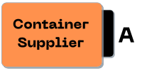
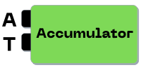
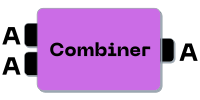
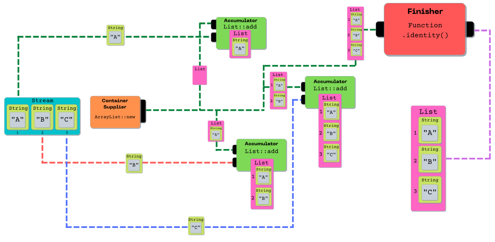
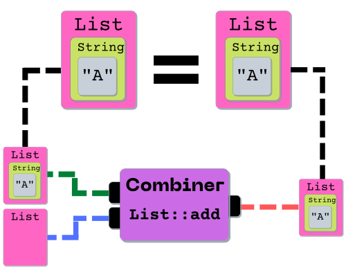
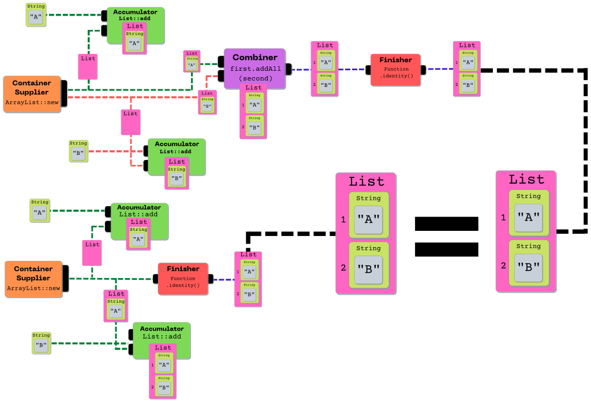
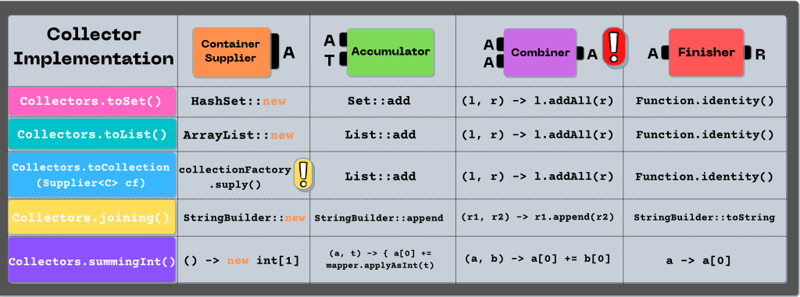
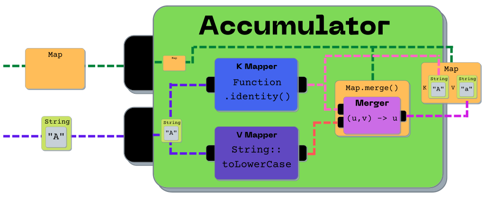
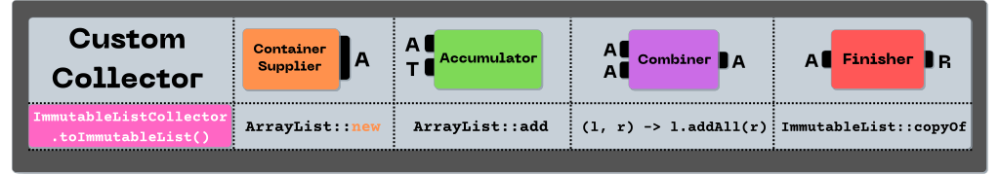

<h1 style="text-align: center;">Java 8 Collector Guide</h1>

---

<h2 style="text-align: center;">Collector Overview:</h2>

`Collector` represents a special *mutable* reduction operation. Elements are incorporated by
updating the state of a mutable container rather than by replacing the intermediate result. This is
desirable behavior when we want to reduce a Stream into some sort of `Collection`. It would be very
inefficient to create a new `Collection` Object during every step of the reduction (*as is typical
in reduction operations*), so we can use `Collector` to avoid that.

We'll dive deeper into the finer points of *collection* vs *reduction* in a separate tutorial. For
now, let's take a look at the pieces that make up a `Collector`.

<h3 style="text-align: center;">Container Supplier</h3>

<p align="center">
  
</p>

The container supplier is responsible for creating a new mutable container for the result. It has
the following abstract method signature:

```java
Supplier<A> supplier();
```

<h2 style="text-align: center;">Accumulator</h2>

<p align="center">
  
</p>

The accumulator incorporates data elements into the result container. It has the following abstract
method signature:

```java
BiConsumer<A, T> accumulator();
```

<h2 style="text-align: center;">Combiner</h2>

<p align="center">
  
</p>

The combiner used (in the Stream framework) during parallel execution. Separate threads will process
separate sections of the stream, accumulating their partial result into a mutable container. Those
containers eventually need to be combined into one single result, hence the combiner BinaryOperator.
It has the following abstract method signature:

```java
BinaryOperator<A> combiner();
```

<h2 style="text-align: center;">Finisher</h2>

<p align="center">
  
</p>

Performs optional final transformation. Collectors may set (*and the majority do*)
the `IDENTITY_TRANSFORM` characteristic, in which case the finishing transformation is an identity
function with an unchecked cast from `A` to `R`. It has the following abstract method signature:

```java
Function<A, R> finisher();
```

---

<h2 style="text-align: center;">An Example Visualized</h2>

Let's breakdown an example Stream collection process to help understand the different components.
Note the differences between serial and parallel execution.

### Serial Collection:



### Parallel Collection:


---

<h2 style="text-align: center;">What Are The Rules?</h2>

> To ensure that sequential and parallel executions produce equivalent results, the collector functions must satisfy an identity and an associativity constraints.
> -- <cite>JavaDoc</cite>

Essentially, there are two things that must hold true in order for a Collector to perform
equivalently during parallel and sequential execution.

### The Identity Constraint

<p align="center">
  
</p>

> The identity constraint says that for any partially accumulated result, combining it with an empty result container must produce an equivalent result. That is, for a partially accumulated result a that is the result of any series of accumulator and combiner invocations, a must be equivalent to
> ```java
> combiner.apply(a, supplier.get())
> ```
> -- <cite>JavaDoc</cite>

### The Associativity Constraint

<p align="center">
  
</p>

> The associativity constraint says that splitting the computation must produce an equivalent result. That is, for any input elements t1 and t2, the results r1 and r2 in the computation below must be equivalent:
> ```java
> A a1 = supplier.get();
> accumulator.accept(a1, t1);-
> accumulator.accept(a1, t2);
> R r1 = finisher.apply(a1);  // result without splitting
>
> A a2 = supplier.get();
> accumulator.accept(a2, t1);
> A a3 = supplier.get();
> accumulator.accept(a3, t2);
> R r2 = finisher.apply(combiner.apply(a2, a3));  // result with splitting
> ```
> -- <cite>JavaDoc</cite>


---

<h2 style="text-align: center;">A Collection of Collectors</h2>

Now that we have a feel for the different components of a `Collector`, let's take a look at just a
few of the JDK supplied Collectors.

### JDK Convenience Collectors



<p align="center">
  
</p>

### Collecting into Maps

In order to collect into a `Map`, we basically need to upgrade our accumulator into a higher order
function, composed of three other functions. These "sub" functions are:

<h3 style="text-align: center;">Key Mapper</h3>

<p align="center">
  
</p>

The container supplier is responsible for creating a new mutable container for the result. It has
the following abstract method signature:

```java
Supplier<A> supplier();
```

<h3 style="text-align: center;">Value Mapper</h3>

<p align="center">
  
</p>

The container supplier is responsible for creating a new mutable container for the result. It has
the following abstract method signature:

```java
Supplier<A> supplier();
```

<h3 style="text-align: center;">Merger</h3>

<p align="center">
  
</p>

The container supplier is responsible for creating a new mutable container for the result. It has
the following abstract method signature:

```java
Supplier<A> supplier();
```

<h3 style="text-align: center;">All Composed Together</h3>

<p align="center">
  
</p>

### Build Your Own:

What if none of the supplied Collectors meet our needs? In that case, implementing our own should be
no problem! Let's create a `Collector` similar to `Collectors.toList`, but that applies a finishing
step of copying the mutable result container into an `ImmutableList`.



```java
public class ImmutableListCollector<T> implements Collector<T, List<T>, ImmutableList<T>> {

    @Override
    public Supplier<List<T>> supplier() {
        return ArrayList::new;
    }

    @Override
    public BiConsumer<List<T>, T> accumulator() {
        return List::add;
    }

    @Override
    public BinaryOperator<List<T>> combiner() {
        return (l1, l2) -> {
            l1.addAll(l2);
            return l1;
        };
    }

    @Override
    public Function<List<T>, ImmutableList<T>> finisher() {
        return ImmutableList::copyOf;
    }

    @Override
    public Set<Characteristics> characteristics() {
        return Collections.emptySet();
    }

    public static <T> ImmutableListCollector<T> toImmutableList() {
        return new ImmutableListCollector<>();
    }
}
```

---

<h2 style="text-align: center;">Resources / Further Reading</h2>

* https://docs.oracle.com/javase/8/docs/api/java/util/stream/Collector.html

* https://docs.oracle.com/javase/8/docs/api/java/util/stream/Collector.Characteristics.html

* https://apprize.best/javascript/lambda/6.html

* https://www.baeldung.com/java-8-collectors

* https://dkeenan.com/Lambda/

* https://www.amazon.com/Mock-Mocking-Bird-Including-Combinatory-ebook/dp/B00A1P096Y/ref=tmm_kin_swatch_0?_encoding=UTF8&qid=&sr=


