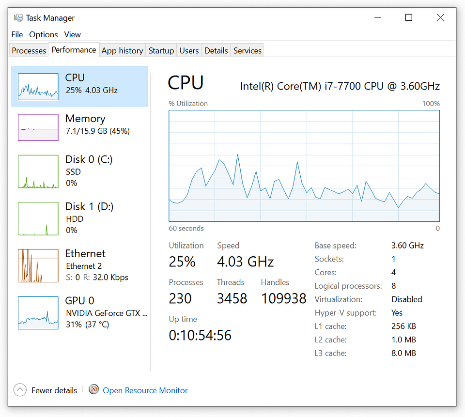
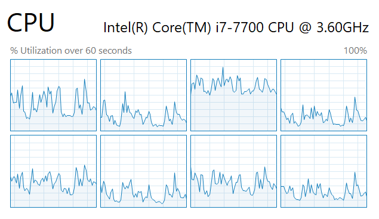
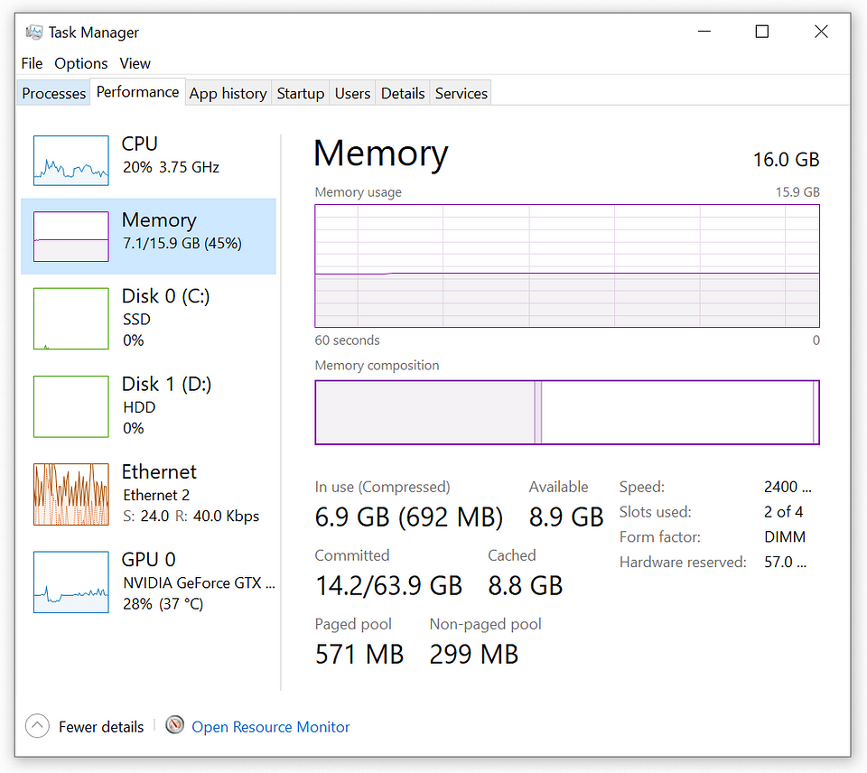
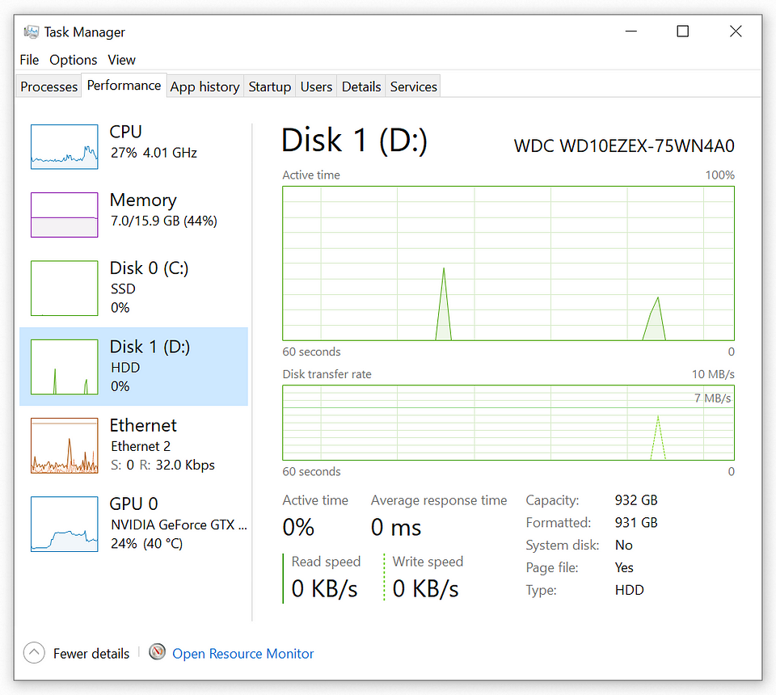

# My CompTIA A+ Certification Journey

Greetings, everyone! I'm diving into the world of IT and taking you along for the ride. What's on
the agenda? Conquering the CompTIA A+ certification, step by step. Join me as I break down the exam
into bite-sized chunks, and I'll be sharing the resources and tips that are helping me level up my
skills. Whether you're a tech enthusiast or just someone looking to learn something new, let's
tackle this certification together.

- 1.0 Operating Systems
    - 1.1 Identify basic features of Microsoft Windows editions.
    - 1.2 Given a scenario, use the appropriate Microsoft command-line tool.
    - 1.3 Given a scenario, use features and tools of the Microsoft Windows 10 operating system (OS)
      .
    - 1.4 Given a scenario, use the appropriate Microsoft Windows 10 Control Panel utility.
    - 1.5 Given a scenario, use the appropriate Windows settings.
    - 1.6 Given a scenario, configure Microsoft Windows networking features on a client/desktop.
    - 1.7 Given a scenario, apply application installation and configuration concepts.
    - 1.8 Explain common OS types and their purposes.
    - 1.9 Given a scenario, perform OS installations and upgrades in a diverse OS environment.
    - 1.10 Identify common features and tools of the macOS/desktop OS.
    - 1.11 Identify common features and tools of the Linux client/desktop OS.
- 2.0 Security
    - 2.1 Summarize various security measures and their purposes.
    - 2.2 Compare and contrast wireless security protocols and authentication methods.
    - 2.3 Given a scenario, detect, remove, and prevent malware using the appropriate tools and
      methods.
    - 2.4 Explain common social-engineering attacks, threats, and vulnerabilities.
    - 2.5 Given a scenario, manage and configure basic security settings in the Microsoft Windows
      OS.
    - 2.6 Explain basic change-management best practices.
    - 2.7 Given a scenario, implement workstation backup and recovery methods.
    - 2.8 Use common safety procedures.
    - 2.9 Explain the importance of prohibited content/activity and privacy, licensing, and policy
      concepts.
    - 2.10 Use proper communication techniques and professionalism.
- 3.0 Software Troubleshooting
    - 3.1 Troubleshoot common Windows OS problems.
    - 3.2 Troubleshoot common personal computer (PC) security issues. 3.3 Use best practice
      procedures for malware removal.
    - 3.4 Troubleshoot common mobile OS and application issues.
    - 3.5 Troubleshoot common mobile OS and application security issues.
- 4.0 Operational Procedures
    - 4.1 Implement best practices associated with documentation and support systems information
      management.
    - 4.2 Explain basic change-management best practices.
    - 4.3 Implement workstation backup and recovery methods.
    - 4.4 Use common safety procedures.
    - 4.5 Summarize environmental impacts and local environmental controls.
    - 4.6 Explain the importance of prohibited content/activity and privacy, licensing, and policy
      concepts.
    - 4.7 Use proper communication techniques and professionalism.
    - 4.8 Identify the basics of scripting.
    - 4.9 Use remote access technologies.

I think it only makes sense to start at the beginning, so let's tackle the first objective and
identify the basic features of Microsoft Windows editions.

## 1.1. Identify basic features of Microsoft Windows editions.

**Windows 10 Home**: Designed for the average consumer, Windows 10 Home offers a user-friendly
experience with features like Cortana, Microsoft Edge, and the Start Menu. It's suitable for
everyday tasks and entertainment and is a popular choice for home users.

**Windows 10 Pro**: Windows 10 Pro is built for business and power users. It includes all the
features of Windows 10 Home plus additional security and management tools like BitLocker, remote
desktop access, and the ability to join a domain. It's an excellent choice for small businesses and
professionals.

**Windows 10 Pro for Workstations**: This edition is designed for high-performance PCs and
workstations. It includes features like ReFS (Resilient File System) and support for high-end
hardware configurations, making it ideal for users who need exceptional performance and reliability.

**Windows 10 Enterprise**: Geared towards large organizations and businesses, Windows 10 Enterprise
offers advanced security, management, and deployment features. It includes Windows Defender
Credential Guard, AppLocker, and Windows To Go, making it suitable for enterprises with complex IT
infrastructures.

**Windows 10 Education**: Windows 10 Education builds on the commercial version of Windows 10 Pro
but is tailored for educational institutions. It provides tools for educators and students,
including enhanced security, simplified deployment, and access to Microsoft's education-specific
apps and services.

### 1.1.1. Upgrade Paths

Upgrade paths, in the context of Windows 10, refer to the routes or options available for
transitioning from an older Windows operating system, such as Windows 7 or Windows 8, to Windows10.
These paths outline which editions of Windows 10 are accessible based on the edition of the older
Windows OS you are currently using. The upgrade path also specifies whether it's a full upgrade (
which includes preserving personal data, settings, and applications) or a downgrade (where personal
data is maintained, but applications and settings are removed). Understanding upgrade paths is
essential for individuals planning to migrate to Windows 10, as it helps them determine which
edition they can move to and what data they should expect to retain during the upgrade process.

### 1.1.2. BitLocker

BitLocker is a built-in feature in Windows operating systems that provides data encryption and
security for your computer's hard drive or other storage devices. It works by encrypting the entire
drive, making it nearly impossible for unauthorized users to access your data without the
appropriate encryption key. Sample BitLocker use-case from a user's perspective:
Enable BitLocker: Go to the Control Panel, select "System and Security," and click on "BitLocker
Drive Encryption." From there, you can choose which drive you want to encrypt and follow the setup
wizard. Choose Your Unlock Method: You'll be asked to choose how you want to unlock the drive.
Options typically include using a password, a PIN, or a USB drive. Select the one that suits your
preference and security needs. Backup Your Recovery Key: BitLocker will generate a recovery key that
you should store in a safe place. This key is essential in case you forget your password or PIN, as
it allows you to regain access to your encrypted drive. Start Encryption: Once you've configured
your settings and saved the recovery key, BitLocker will begin encrypting your drive in the
background. This process may take some time, depending on the size of the drive. Restart Your
Computer: After the encryption is complete, you may need to restart your computer. BitLocker will
prompt you to enter your password, PIN, or insert the USB drive to unlock the encrypted drive every
time you boot your computer.

BitLocker provides an added layer of security to protect your data from unauthorized access,
especially in the event that your computer or storage device is lost or stolen.

### 1.1.3. Remote Desktop Protocol (RDP)

First introduced in 1998 for Windows NT 4.0 Terminal Server Edition, Remote Desktop Protocol (RDP)
is a technology developed by Microsoft that allows users to connect to and control a remote computer
or server over a network. With RDP, you can access and interact with a remote desktop as if you were
physically present in front of it. This technology is commonly used for remote administration,
technical support, or accessing resources on a remote machine. To use RDP, the remote computer must
be running a Windows operating system, and you need proper credentials and permissions to establish
a secure connection. RDP provides a convenient way to work on distant computers, troubleshoot
issues, or manage remote servers efficiently. Remote Desktop Protocol (RDP) is not available in
Windows 10 Home Edition. It is a feature included in Windows 10 Pro, Windows 10 Pro Education,
Windows 10 Education, and Windows 10 Enterprise editions. These editions are designed to provide
more advanced networking and remote access capabilities, which include RDP, making them suitable for
business and professional use cases. Windows 10 Home, on the other hand, is intended for consumer
and basic home use and lacks some of these advanced networking features.

### 1.1.4. Domain Access vs. Workgroup

Access Domain access and workgroup access are two different ways to manage networked computers in a
Windows environment. In a domain, computers are part of a centralized network managed by a server,
often referred to as a domain controller. This setup allows for centralized user authentication,
security policies, and resource management. Users log in using domain credentials, and
administrators can control access, enforce security policies, and manage resources centrally. On the
other hand, in a workgroup, computers are more decentralized. Each computer maintains its own user
accounts and security settings, and users typically log in with local accounts unique to each
machine. Workgroups are suitable for small networks or peer-to-peer setups where centralized
management and security aren't as critical. Domain access provides more robust control and
scalability, making it suitable for larger networks and organizations, while workgroups are simpler
and easier to set up for smaller, less complex environments. In Windows 10, every edition except for
Windows 10 Home supports domain access. Windows 10 Pro, Windows 10 Pro Education, Windows 10
Education, and Windows 10 Enterprise editions all have the capability to join and connect to
domains, making them suitable for business and enterprise environments where centralized network
management and security are essential. Windows 10 Home, being more consumer-oriented, doesn't
include this feature.

### 1.1.5. Group Policy Editor

gpedit.msc stands for Group Policy Editor. It's a Microsoft Management Console (MMC) application
that allows users to manage various Windows system settings and policies in a centralized and
organized way. Group policies are a set of rules and configurations that control the working
environment of user accounts and computer accounts in Windows. Here's a brief explanation:
Group Policy Editor is primarily used by system administrators and advanced users to:
Manage System Policies: It enables administrators to configure policies that affect the behavior and
settings of Windows operating systems. These policies can control security settings, application
settings, network configurations, and more. Enforce Security: Administrators can use Group Policy to
enforce security measures across a network, such as password policies, access controls, and firewall
rules. Customize User Experience: Group Policy allows for the customization of the Windows user
interface, including hiding or showing specific elements of the operating system. Deploy Software:
Administrators can use Group Policy to deploy and manage software installations and updates across a
network of Windows computers. Centralized Management: It provides a centralized location to
configure and manage these policies across multiple computers in an Active Directory domain or on a
local computer.

To access gpedit.msc, you can open the Run dialog (Windows Key + R), type gpedit.msc, and press
Enter. Please note that gpedit.msc is not available in Windows Home editions; it's typically found
in Windows Pro, Education, and Enterprise editions.

## 1.2. Given a scenario, use the appropriate Microsoft command-line tool.

### 1.2.1. cd / chdir: Full Microsoft doc here.

Allows you to view or change the current directory. If you provide a drive letter (e.g., `cd C:`),
it shows the current directory in that drive, and without any parameters, it displays the current
drive and directory.

```
C:\>cd Documents 
C:\Documents>cd D:\
D:\
C:\Documents>cd \d D:\
D:\
```

### 1.2.2 dir: Full Microsoft doc here.

The `dir` command in Microsoft is a versatile tool used for listing and displaying the contents of a
directory. It provides valuable information such as file names, sizes, attributes (including hidden
or read-only status), creation times, and modification dates.

```
C:/temp> dir

 Volume in drive C is OS 
 Volume Serial Number is XXXX-XXXX

 Directory of C:\Temp

12/06/2023 04:30 PM    <DIR>          . 
12/06/2023 04:30 PM    <DIR>          .. 
12/06/2023 04:30 PM                 0 example_file.txt 
              1 File(s)              0 bytes 
              2 Dir(s)  XXX,XXX,XXX,XXX bytes free 
```

### 1.2.3 md: Full Microsoft doc here.

The `md` command is used to create a new directory (folder) in the specified path.

#### Command Syntax:

```
md [drive:]path
```

- `[drive:]path`: Specifies the location where the new directory will be created.

#### Create a new folder named `NewFolder` in `C:\Temp`:

```
C:\>md C:\Temp\NewFolder 
```

After executing the command, the specified directory will be created, and you can then navigate to
it using File Explorer or other command-line tools.

### 1.2.4 rmdir: Full Microsoft doc here.

The `rmdir` command is used to remove (delete) a directory.

#### Command Syntax:

```
rmdir [/s][/q] [drive:]path
```

- `[drive:]path`: Specifies the location where the directory is to be deleted.
- `/s`: Removes the specified directory and its subdirectories (use with caution as it deletes all
  files and subdirectories).
- `/q`:Quiet mode; does not prompt for confirmation.

#### Remove a directory named "OldFolder" in C:\Temp:

```
C:\>rmdir C:\Temp\OldFolder 
```

Remember to exercise caution when using the `/s` option, as it will remove the specified
directory **and** its subdirectories, including all files within them.

### 1.2.5. Drive Navigation Inputs: Full Microsoft doc here.

To change the drive, simply type the drive letter followed by a colon and press Enter. For example:

```
C:\>D:
D:\> 
```

This command will switch to the `D:` drive. Replace `D:` with the letter of the drive you want to
navigate to. If you want to change to a specific directory on the newly selected drive, you can use
the `cd` command. For example:

```
C:\>cd \Path\To\Your\Directory 
```

Replace `\Path\To\Your\Directory` with the actual path of the directory you want to navigate to. To
verify that you have successfully switched to the desired drive and directory, you can use the `cd`
command without any arguments to display the current directory. For example:

```
C:\>cd 
```

This command will display the current directory on the selected drive.

### 1.2.6. ipconfig: Full Microsoft doc here.

The `ipconfig` command in Windows is used to display information about the computer's network
configuration. It provides details such as the IP address, subnet mask, and default gateway for all
network interfaces on the system. Additionally, ipconfig can show information about DNS servers and
other network-related settings. This command is useful for troubleshooting network connectivity
issues and obtaining information about the computer's network configuration. Command Syntax:

```
ipconfig [/all]
```

Options:

- `/all`: Displays detailed information about all network interfaces, including physical and virtual
  interfaces.

```
C:\>ipconfig /all

Windows IP Configuration 
Ethernet adapter Local Area Connection:
   Connection-specific DNS Suffix  . : example.com 
   IPv4 Address. . . . . . . . . . . : 192.168.1.2
   Subnet Mask . . . . . . . . . . . : 255.255.255.0 
   Default Gateway . . . . . . . . . : 192.168.1.1
Wireless LAN adapter Wi-Fi:
   Connection-specific DNS Suffix  . : example.com 
   IPv4 Address. . . . . . . . . . . : 192.168.1.5
   Subnet Mask . . . . . . . . . . . : 255.255.255.0 
   Default Gateway . . . . . . . . . : 192.168.1.1
Tunnel adapter Teredo Tunneling Pseudo-Interface:
   Connection-specific DNS Suffix  . :
   IPv6 Address. . . . . . . . . . . : 2001:0:9d38:953c:2428:1a2f:acd9:1234 
   Link-local IPv6 Address . . . . . : fe80::2428:1a2f:acd9:1234%12 
   Default Gateway . . . . . . . . . : ::
```

### 1.2.7. ping: Full Microsoft doc here.

The `ping` command in the Windows command line is used to test the reachability of a network host
and measure the round-trip time for messages sent from the source to the destination.

#### Command Syntax:

```
ping [-t] [-a] [-n count] [-l size] [-f] [-i TTL] [-v TOS] [-r count] [-s count] [-w timeout] [hostname or IP address]
```

Options:

- `-t`: Sends ping requests to the specified host until the command is manually stopped (Ctrl+C).
- `-a`: Resolves addresses to hostnames.
- `-n count`: Specifies the number of echo requests to send.
- `-l size`: Specifies the size, in bytes, of the echo request packet.
- `-f`: Sets the Don't Fragment flag in the packet.
- `-i TTL`: Specifies the Time To Live (TTL) value for echo request packets.
- `-v TOS`: Specifies the Type Of Service (TOS) value for echo request packets.
- `-r count`: Records the route for count hops.
- `-s count`: Specifies the time stamp for count hops.
- `-w timeout`: Specifies the timeout, in milliseconds, to wait for each reply.

#### Ping a server or website (e.g., www.example.com):

```
C:\>ping -t www.example.com

Pinging www.example.com [93.184.216.34] with 32 bytes of data:
Reply from 93.184.216.34: bytes=32 time=10ms TTL=57 
Reply from 93.184.216.34: bytes=32 time=12ms TTL=57 
Reply from 93.184.216.34: bytes=32 time=11ms TTL=57 
Reply from 93.184.216.34: bytes=32 time=10ms TTL=57

Ping statistics for 93.184.216.34:
    Packets: Sent = 4, Received = 4, Lost = 0 (0% loss), 
Approximate round trip times in milli-seconds:
    Minimum = 16ms, Maximum = 20ms, Average = 18ms 
```

### 1.2.8. hostname: Full Microsoft doc here.

The `hostname` command in the Windows command line is used to display the name of the current host (
computer) on a network.

#### Command Syntax:

```
hostname 
```

The command outputs the host (computer) name assigned to the system, which is typically used for
identification on a network.

#### Get the hostname of the current system:

```
C:\>hostname 
My-Computer-Name 
```

### 1.2.9. netstat: Full Microsoft doc here. The netstat command in the

The `netstat` command displays network-related information, such as active connections, listening
ports, and routing tables.

#### Command Syntax:

```
netstat [-a] [-b] [-n] [-o] [-p protocol] [-r] [-s] [interval]
```

Options:

- `-a`: Displays all connections and listening ports.
- `-b`: Displays the executable involved in creating each connection or listening port.
- `-n`: Displays addresses and port numbers in numerical form.
- `-o`: Displays the owning process ID associated with each connection.
- `-p proto`: Shows connections for the specified protocol (TCP, UDP).
- `-r`: Displays the routing table.
- `-s`: Displays per-protocol statistics.
- `interval`: Redisplay updated data every "interval" seconds.

#### Display All Active Connections:

```
C:\>netstat -a

Active Connections

Proto Local Address Foreign Address State 
TCP 192.128.1.2.52011 151.101.129.69:http ESTABLISHED 
TCP 192.128.1.2.52012 151.101.129.69:http ESTABLISHED 
```

#### Display Executable Involved in Connection:

```
C:\>netstat -b

Active Connections

  Proto Local Address Foreign Address State
  TCP 192.168.0.2:49152 52.124.164.21:https ESTABLISHED 1234
 [svchost.exe]
  TCP 192.168.0.2:49153 52.124.164.22:https ESTABLISHED 5678
 [chrome.exe]
  TCP 192.168.0.2:49154 52.124.164.23:https ESTABLISHED 9012
 [firefox.exe]
```

#### Display Routing Table:

```
C:\>netstat -r

IPv4 Route Table
===========================================================================
Active Routes:
Network Destination        Netmask          Gateway       Interface  Metric
          0.0.0.0          0.0.0.0      192.168.1.1      192.168.1.2    25
        127.0.0.0        255.0.0.0         On-link         127.0.0.1    331
        127.0.0.1  255.255.255.255         On-link         127.0.0.1    331
      192.168.1.0    255.255.255.0         On-link       192.168.1.2    281
      192.168.1.2  255.255.255.255         On-link       192.168.1.2    281
    192.168.1.255  255.255.255.255         On-link       192.168.1.2    281
      192.168.2.0    255.255.255.0      192.168.1.1      192.168.1.2    26
      192.168.3.0    255.255.255.0      192.168.1.1      192.168.1.2    26
        224.0.0.0        240.0.0.0         On-link         127.0.0.1    331
        224.0.0.0        240.0.0.0         On-link       192.168.1.2    281
        224.0.0.0        240.0.0.0         On-link       192.168.1.2    281
  255.255.255.255  255.255.255.255         On-link         127.0.0.1    331
  255.255.255.255  255.255.255.255         On-link       192.168.1.2    281
  255.255.255.255  255.255.255.255         On-link       192.168.1.2    281
Default Gateway:   192.168.1.1

Interface List
 18...00 50 56 91 11 22 ......Intel(R) Ethernet Connection I219-V
 25...00 1f 16 8c 11 22 ......Microsoft Wi-Fi Direct Virtual Adapter
 22...02 00 54 74 68 72 ......Microsoft Teredo Tunneling Adapter
  1...........................Software Loopback Interface 1

IPv6 Route Table
===========================================================================
Active Routes:
 If Metric Network Destination      Gateway
 18    331 ::/0                     fe80::1
  1    331 ::1/128                  On-link
 18    331 2001::/32                On-link
```

The specific details in the output may vary based on the system's network configuration and active
connections.

### 1.2.10 nslookup: Full Microsoft doc here.

The `nslookup` command in the Windows command line is used for querying Domain Name System (DNS)
servers to obtain domain name or IP address information.

#### Command Syntax:

```
nslookup [hostname or IP address] [DNS server]
```

Options:

- `hostname or IP address`: Specifies the domain name or IP address to be queried.
- `DNS server`: Specifies the DNS server to be used for the query. If not specified, the default DNS
  server will be used.

#### Querying for IP Address of a Domain:

```
C:\> nslookup www.example.com
Server:  dns.example.com
Address:  192.168.1.1

Non-authoritative answer:
Name:    www.example.com
Addresses:  93.184.216.34
```

#### Reverse DNS Lookup (IP to Hostname):

```
C:\> nslookup 93.184.216.34
Server:  dns.example.com
Address:  192.168.1.1

Non-authoritative answer:
Name:    www.example.com
Addresses:  93.184.216.34
```

#### Using a Different DNS Server:

```
C:\> nslookup www.example.com 8.8.8.8
Server:  dns.google
Address:  8.8.8.8

Non-authoritative answer:
Name:    www.example.com
Addresses:  93.184.216.34
```

### 1.2.11. chkdsk: Full Microsoft doc here.

The `chkdsk` command in the Windows command line is used to check a disk for errors and fix issues
with the file system and the physical storage.

#### Command Syntax:

```
chkdsk [drive:] [/f] [/r] [/x]
```

Options:

- `drive`: Specifies the drive letter (with a colon) of the disk to be checked.
- `/f`: Fixes errors on the disk. It is used to automatically fix issues without requiring user
  input.
- `/r`: Locates bad sectors on the disk and recovers readable information. Implies the /f option.
- `/x`: Forces the volume to dismount first, if necessary. All open handles to the drive are
  invalidated. Implies the /f option.

#### Check Disk on Drive C: with Automatic Repair:

```
C:> chkdsk C:

Checking file system on C:
The type of the file system is NTFS.

Volume label is System.

Stage 1: Examining basic file system structure ...
  123456 file records processed.
File verification completed.
  7890 large file records processed.
  0 bad file records processed.

Stage 2: Examining file name linkage ...
  123456 index entries processed.
Index verification completed.
  0 unindexed files scanned.
  0 unindexed files recovered to lost and found.

Stage 3: Examining security descriptors ...
Security descriptor verification completed.
  7890 data files processed.
CHKDSK is verifying Usn Journal...
  45678912 USN bytes processed.
Usn Journal verification completed.

Windows has checked the file system and found no problems.

 97656448 KB total disk space.
 65432100 KB in 123456 files.
     56789 KB in 7890 indexes.
         0 KB in bad sectors.
    987654 KB in use by the system.
     65536 KB occupied by the log file.
 32109876 KB available on disk.

      4096 bytes in each allocation unit.
 24414112 total allocation units on disk.
  8024697 allocation units available on disk.

Internal Info:
00 22 33 44 55 66 77 88 99 aa bb cc dd ee ff 00 11 22 33 44 55 66 77 88 99 aa bb cc dd ee ff

Windows has finished checking your disk.
Please wait while your computer restarts.
```

#### Check Disk with Automatic Repair and Bad Sector Recovery:

```
C:> chkdsk C: /r

Checking file system on C:
The type of the file system is NTFS.

Volume label is System.

Stage 1: Examining basic file system structure ...
  123456 file records processed.
File verification completed.
  7890 large file records processed.
  0 bad file records processed.

Stage 2: Examining file name linkage ...
  123456 index entries processed.
Index verification completed.
  0 unindexed files scanned.
  0 unindexed files recovered to lost and found.

Stage 3: Examining security descriptors ...
Security descriptor verification completed.
  7890 data files processed.
CHKDSK is verifying Usn Journal...
  45678912 USN bytes processed.
Usn Journal verification completed.

Stage 4: Looking for bad sectors in user file data ...
  45678912 KB in 987654 recoverable files.
CHKDSK discovered free space marked as allocated in the
master file table (MFT) bitmap.
Correcting errors in the master file table's (MFT) BITMAP attribute.
Correcting errors in the Volume Bitmap.

Windows has made corrections to the file system.

 97656448 KB total disk space.
 65432100 KB in 123456 files.
     56789 KB in 7890 indexes.
         0 KB in bad sectors.
    987654 KB in use by the system.
     65536 KB occupied by the log file.
 32109876 KB available on disk.

      4096 bytes in each allocation unit.
 24414112 total allocation units on disk.
  8024697 allocation units available on disk.

Internal Info:
00 22 33 44 55 66 77 88 99 aa bb cc dd ee ff 00 11 22 33 44 55 66 77 88 99 aa bb cc dd ee ff

Windows has finished checking your disk.
Please wait while your computer restarts.
```

The command output provides information about the file system type, the progress of the check, and
any corrections made to the file system. The user might also be prompted to schedule a disk check on
the next system restart if the drive is currently in use.

### 1.2.12. net user: Full Microsoft doc here.

The `net user` command in the Windows command line is used to manage user accounts. It allows you to
view user account information, change user passwords, and perform other account-related tasks.

#### Command Syntax:

```
net user [username [password | *] [options]] [/domain]
```

Options:

- `username`: Specifies the name of the user account.
- `*password | *`: Sets or changes the password for the user. Use * to prompt for the password.
  options:
  Various options for managing user accounts.
- `/domain`: Performs the operation against a domain controller, not the local machine.

#### View User Account Information:

```
C:\>net user John

User name                    John
Full Name                    John Doe
Comment                      Example User Account
User's comment
Country/region code          000 (System Default)
Account active               Yes
Account expires              Never

Password last set            MM/DD/YYYY
Password expires             MM/DD/YYYY
Password changeable          MM/DD/YYYY
Password required            Yes
User may change password     Yes

Workstations allowed         All
Logon script
User profile
Home directory
Last logon                   MM/DD/YYYY
Logon hours allowed          All

Local Group Memberships      *LocalGroupName1       *LocalGroupName2
Global Group memberships     *GlobalGroupName1      *GlobalGroupName2

The command completed successfully.
```

#### Change User Password:

```
C:\>net user John newpassword
The command completed successfully.
```

#### Prompt for new Password:

```
C:\>net user John *
Type a password for the user:
Retype the password to confirm:
The command completed successfully.
```

#### Add User to a Group:

```
C:\>net user John \add
The command completed successfully.
```

If you need to provide additional details such as a password, user profile path, or other settings,
you would include those as part of the command. The actual output may vary based on the specific
user accounts and settings on the system.

### 1.2.13. net use: Full Microsoft doc here.

The `net use` command in the Windows command line is used to connect or disconnect a computer from a
shared resource or to display information about existing connections. Command Syntax:

```
net use [device_name | *] [\\computer_name\share_name[\volume] [password | *]] [/user:[domain_name\]user_name] [/persistent:{yes | no}]
```

- `device_name | *`: Specifies the drive letter or printer port to be used.
- `\\computer_name\share_name[\volume]`: Specifies the shared resource to connect to.
- `password | *`: Specifies the password for the user account. Use `*` to prompt for the password.
- `/user:[domain_name]user_name`: Specifies the user name to use when connecting to the shared
  resource.
- `/persistent:{yes | no}`: Determines whether the connection should be persistent across reboots.

#### Map Network Drive:

```
C:\>net use Z: \\sever\share
The command completed successfully.
```

#### Disconnect from a Network:

```
C:\>net use Z: /delete
The command completed successfully.
```

#### Display Information about Network Connections:

```
C:\>net use
New connections will be remembered.

Status       Local     Remote                    Network

-------------------------------------------------------------------------------
OK           Z:        \\server\share            Microsoft Windows Network
The command completed successfully.
```

### 1.2.14 tracert: Full Microsoft doc here.

The `tracert` (trace route) command in the Windows command line is used to trace the route that
packets take to reach a destination on the network. It shows the sequence of routers or hops that
the packets traverse to reach the target.

#### Command Syntax:

tracert [-d] [-h maximum_hops] [-j host-list] [-w timeout] target_name

Options:

- `-d`: Do not resolve addresses to hostnames.
- `-h maximum_hops`: Specifies the maximum number of hops to search for the target.
- `-j host-list`: Loose source route along host-list (IPv4-only).
- `-w timeout`: Waits for the specified number of milliseconds for each reply.
- `target_name`: Specifies the destination host or IP address.

#### Basic Trace Route:

```
C:\>tracert www.example.com
Tracing route to www.example.com [93.184.216.34]
over a maximum of 30 hops:

  1    <1 ms    <1 ms    <1 ms  your_router_IP
  2     5 ms     4 ms     3 ms  ISP_router_IP
  3     8 ms     9 ms     8 ms  some_other_router_IP
  4    15 ms    14 ms    16 ms  destination_router_IP

Trace complete.
```

#### Trace Route with Maximum Hops and Timeout:

```
C:\>tracert -h 15 -w 500 www.example.com
Tracing route to www.example.com [93.184.216.34]
over a maximum of 15 hops:

  1    <1 ms    <1 ms    <1 ms  your_router_IP
  2     5 ms     4 ms     3 ms  ISP_router_IP
  3     *        9 ms     8 ms  some_other_router_IP
  4    15 ms    14 ms    16 ms  destination_router_IP

Trace complete.
```

Any timeouts are indicated by an `*`. A timeout can occur for various reasons, such as network
congestion, router configuration, or a firewall blocking the ICMP packets used by tracert. It's not
uncommon to see occasional timeouts, especially on the public internet where there are many factors
affecting packet delivery.

### 1.2.15 format: Full Microsoft doc here.

The `format` command in the Windows command line is used to prepare a disk volume for use by
creating a new file system. It is often used to format removable storage devices such as USB drives
or SD cards.

#### Command Syntax:

```
format [/fs:filesystem] [/v:label] [/q] [/c] [/x] [/p:passes] [/l] [/y]
```

Options:

- `/fs:filesystem`: Specifies the file system to use (*FAT*, *FAT32*, *exFAT*, *NTFS*).
- `/v`:label: Specifies the volume label.
- `/q`: Performs a quick format.
- `/c`: NTFS only: Files created on the new volume will be compressed by default. /x: Forces the
  volume to dismount first if necessary.
- `/p`:passes: Zeroes sectors on the disk the specified number of times.
- `/l`: NTFS only: Overrides the default size of file records.
- `/y`: Suppresses prompting to confirm that you want to erase the volume.

#### Quick Format with Default File System:

```
C:\>format E: \q
The type of the file system is NTFS.
Enter current volume label for drive E: MY_DRIVE
WARNING, ALL DATA ON NON-REMOVABLE DISK
DRIVE E: WILL BE LOST!
Proceed with Format (Y/N)? Y
QuickFormatting 1024M
Creating file system structures.
Format complete.
1,024.00 MB total disk space.
1,024.00 MB are available.
        4.00 KB in 2 files.
        64 KB in 16 indexes.
           512 KB in bad sectors.
       1,024.00 MB in use by the system.
  1,022.98 MB available on disk.
          4,096 bytes in each allocation unit.
        262,143 allocation units available on disk.
           256 bytes in each index.
        1,023 indexes available on disk.
```

#### Full Format with Specified File System and Volume Label:

```
C:\>format F: /fs:FAT32 /v:MyDrive /p:1
Insert new disk for drive F:
and press ENTER when ready...
The type of the file system is FAT32.
Verifying 1.44M
Format cannot run because the volume is in use by another
process.  Format may run if this volume is dismounted first.
ALL OPENED HANDLES TO THIS VOLUME WOULD THEN BE INVALID.
Would you like to force a dismount on this volume? (Y/N) Y
Volume dismounted.  All opened handles to this volume are now invalid.
Volume label (11 characters, ENTER for none)? MyDrive
QuickFormatting 1.4M
Creating file system structures.
Format complete.
1.4M total disk space.
1.4M are available.
          512 bytes in each allocation unit.
        2,880 allocation units available on disk.
           16 bits in each FAT entry.
           1,440 bytes in each reserved sector.
           1 FATs.
           2 sectors in each cluster.
        1,471 total clusters on disk.
        1,440 clusters available on disk.
```

### 1.2.16 xcopy: Full Microsoft doc here.

The `xcopy` command in Windows is used to copy files and directories from one location to another.
It provides more advanced features compared to the basic `copy` command, including the ability to
copy entire directory structures, preserve file attributes, and copy files selectively based on
various criteria.

#### Command Syntax:

```
XCOPY source [destination] [/A | /M] [/D[:date]] [/P] [/S [/E]] [/V] [/W]
                           [/C] [/I] [/Q] [/F] [/L] [/G] [/H] [/R] [/T] [/U]
                           [/K] [/N] [/O] [/X] [/Y] [/-Y] [/Z] [/B] [/J]
                           [/EXCLUDE:file1[+file2][+file3]...] [/COMPRESS]
```

Options:

- `source` : Specifies the file(s) to copy.
- `destination` : Specifies the location and/or name of new files.
- `/A` : Copies only files with the archive attribute set, doesn't change the attribute.
- `/M` : Copies only files with the archive attribute set, turns off the archive attribute.
- `/D:m-d-y` : Copies files changed on or after the specified date. If no date is given, copies only
  those files whose source time is newer than the destination time.
- `/EXCLUDE:file1[+file2][+file3]...` : Specifies a list of files containing strings. Each string
  should be in a separate line in the files. When any of the strings match any part of the absolute
  path of the file to be copied, that file will be excluded from being copied. For example,
  specifying a string like \obj\ or .obj will exclude all files underneath the directory obj or all
  files with the .obj extension respectively.
- `/P` : Prompts you before creating each destination file.
- `/S` : Copies directories and subdirectories except empty ones.
- `/E` : Copies directories and subdirectories, including empty ones. Same as /S /E. May be used to
  modify /T.
- `/V` : Verifies the size of each new file.
- `/W` : Prompts you to press a key before copying.
- `/C` : Continues copying even if errors occur.
- `/I` : If destination does not exist and copying more than one file, assumes that destination must
  be a directory.
- `/Q` : Does not display file names while copying.
- `/F` : Displays full source and destination file names while copying.
- `/L` : Displays files that would be copied.
- `/G` : Allows the copying of encrypted files to destination that does not support encryption.
- `/H` : Copies hidden and system files also.
- `/R` : Overwrites read-only files.
- `/T` : Creates directory structure, but does not copy files. Does not include empty directories or
  subdirectories. /T /E includes empty directories and subdirectories.
- `/U` : Copies only files that already exist in destination.
- `/K` : Copies attributes. Normal Xcopy will reset read-only attributes.
- `/N` : Copies using the generated short names.
- `/O` : Copies file ownership and ACL information.
- `/X` : Copies file audit settings (implies /O).
- `/Y` : Suppresses prompting to confirm you want to overwrite an existing destination file.
- `/-Y` : Causes prompting to confirm you want to overwrite an existing destination file.
- `/Z` : Copies networked files in restartable mode.
- `/B` : Copies the Symbolic Link itself versus the target of the link.
- `/J` : Copies using unbuffered I/O. Recommended for very large files.
- `/COMPRESS` : Request network compression during file transfer where applicable.

#### Basic File Copy:

```
C:\>xcopy C:\Source\file.txt D:\Destination\
1 File(s) copied
```

#### Copy Directory with Subdirectories:

```
C:\>xcopy C:\Source\Directory D:\Destination\ /e
C:\Source\Directory\file1.txt
C:\Source\Directory\file2.txt
C:\Source\Directory\Subdirectory1\file3.txt
C:\Source\Directory\Subdirectory1\file4.txt
C:\Source\Directory\Subdirectory2\file5.txt
5 File(s) copied
```

#### Copy Files Modified After a Certain Date:

```
C:\>xcopy C:\Source\* D:\Destination\ /d:12-01-2023
C:\Source\file1.txt
C:\Source\Subdirectory1\file3.txt
C:\Source\Subdirectory2\file5.txt
3 File(s) copied
```

The date format may vary depending on your regional settings, but in this example, it's represented
as "MM-DD-YYYY."

### 1.2.17 copy: Full Microsoft doc here.

The copy command in the Windows command line is used to copy one or more files from one location to
another. It's a basic file copy command with simpler functionalities compared to `xcopy`.

#### Command Syntax:

```
COPY [/D] [/V] [/N] [/Y | /-Y] [/Z] [/L] [/A | /B ] source [/A | /B]
     [+ source [/A | /B] [+ ...]] [destination [/A | /B]]
```

Options:

- `source` : Specifies the file or files to be copied.
- `/A` : Indicates an ASCII text file.
- `/B` : Indicates a binary file.
- `/D` : Allow the destination file to be created decrypted.
- `destination` : Specifies the directory and/or filename for the new file(s).
- `/V` : Verifies that new files are written correctly.
- `/N` : Uses short filename, if available, when copying a file with a non-8dot3 name.
- `/Y` : Suppresses prompting to confirm you want to overwrite an existing destination file.
- `/-Y` : Causes prompting to confirm you want to overwrite an existing destination file.
- `/Z` : Copies networked files in restartable mode.
- `/L` : If the source is a symbolic link, copy the link to the target instead of the actual file
  the source link points to.

#### Basic File Copy:

```
C:\>copy C:\Source\file.txt D:\Destination\
1 file(s) copied.
```

#### Copy With Confirmation Prompt:

```
C:\>copy C:\Source\file.txt D:\Destination\ /-y

Overwrite D:\Destination\file.txt? (Yes/No/All): 
Yes

        1 file(s) copied.
```

#### Copy Multiple Files:

```
copy C:\Source\file1.txt C:\Source\file2.txt D:\Destination\
2 file(s copied.
```

### 1.2.18 robocopy: Full Microsoft doc here.

The `robocopy` command in the Windows command line is a robust utility for copying files and
directories. It provides advanced features and is often used for tasks such as mirroring directories
or copying files with specific attributes. Here is a summary of its key functionalities:

#### Command Syntax:

```
robocopy source destination [file [file]…] [options]
```

Options:

- `source`: Specifies the source directory.
- `destination`: Specifies the destination directory.
- `file [file]…`: Specifies the files to be copied (you can use wildcards).
- `options`: Various optional switches that modify the behavior of the robocopy command.

#### Basic Directory Mirror:

```
C:\>robocopy C:\Source D:\Destination /mir
-------------------------------------------------------------------------------
   ROBOCOPY     ::     Robust File Copy for Windows                              
-------------------------------------------------------------------------------

  Started : Date Time
   Source : C:\Source\
     Dest : D:\Destination\

    Files : *.*

  Options : *.* /MIR /R:1000000 /W:30 

------------------------------------------------------------------------------

                           1    C:\Source\
        Newer                     10    D:\Destination\
------------------------------------------------------------------------------

------------------------------------------------------------------------------

               Total    Copied   Skipped  Mismatch    FAILED    Extras
    Dirs :         1         0         0         0         0         0
   Files :         1         0         0         0         0         0
   Bytes :         0         0         0         0         0         0
   Times :   0:00:00   0:00:00                       0:00:00   0:00:00

   Speed :                  0 Bytes/sec.
   Speed :                 0.000 MegaBytes/min.

   Ended : Date Time
```

In this example:

- `C:\Source\` is the source directory.
- `D:\Destination\` is the destination directory.
- `/MIR` is used to mirror the directories (equivalent to /E and /PURGE combined).
- `/R:1000000` sets the number of retries for failed copies to 1,000,000.
- `/W:30` sets the wait time between retries to 30 seconds.

#### Copy Files with Specific Attributes:

```
C:\>robocopy C:\Source D:\Destination *.txt /a+
-------------------------------------------------------------------------------
   ROBOCOPY     ::     Robust File Copy for Windows                              
-------------------------------------------------------------------------------

  Started : Date Time
   Source : C:\Source\
     Dest : D:\Destination\

    Files : *.txt

  Options : *.* /A+

------------------------------------------------------------------------------

                           1    C:\Source\
        Newer                      5    D:\Destination\
------------------------------------------------------------------------------

------------------------------------------------------------------------------

               Total    Copied   Skipped  Mismatch    FAILED    Extras
    Dirs :         1         1         0         0         0         0
   Files :         5         5         0         0         0         0
   Bytes :         0         0         0         0         0         0
   Times :   0:00:01   0:00:00                       0:00:00   0:00:00

   Speed :                  0 Bytes/sec.
   Speed :                 0.000 MegaBytes/min.

   Ended : Date Time
```

In this example:

- `C:\Source\` is the source directory.
- `D:\Destination\` is the destination directory.
- `*.txt` specifies only *.txt files to be copied.
- `/A+` copies only files with the archive attribute set and resets the archive attribute
  (equivalent to /M combined with /A-).

#### Limit Copy Speed:

The `/IPG` switch in `robocopy` (*Inter-Packet Gap*) is used to specify the inter-packet gap to
control the rate of sending requests to a server.

### 1.2.19 gpupdate: Full Microsoft doc here.

The gpupdate command in the Windows command line is used to manually force a group policy update on
a local computer or a remote computer in a network. It ensures that the latest group policy settings
are applied without waiting for the automatic refresh interval.

#### Command Syntax:

```
gpupdate [/target:{computer | user}] [/force] [/wait:value] [/logoff] [/boot]
```

Options:

- `/target:{computer | user}`: Specifies whether to update computer settings or user settings. By
  default, both are updated.
- `/force`: Forces an immediate update of all settings, regardless of whether they have changed.
- `/wait:value`: Specifies the number of seconds to wait for policy processing to finish.
- `/logoff`: Causes the user to log off after the Group Policy settings have been updated.
- `/boot`: Restarts the computer after the Group Policy settings have been updated.

#### Force Immediate Update for Both Computer and User Settings:

```
C:\>gpupdate /force
Updating policy...

Computer Policy update has completed successfully.
User Policy update has completed successfully.

The command completed successfully.
```

#### Update User Settings Only and Wait for 30 Seconds:

```
C:\> gpupdate /target:user /wait:30
Updating policy...

User Policy update has completed successfully.

The command completed successfully.
```

#### Force Immediate Update and Restart the Computer:

```
C:\> gpupdate /force /boot
Updating policy...

Computer Policy update has completed successfully.
User Policy update has completed successfully.

The computer needs to be restarted to apply these changes.
Restart now? (Y/N)
```

### 1.2.20 gpresult: Full Microsoft doc here.

The `gpresult` command in the Windows command line is used to display the Resultant Set of Policy
(RSoP) for a user or computer. It shows the applied group policy settings and summarizes the
effective policies in effect on the system.

#### Command Syntax:

```
gpresult [/s computer] [/user username] [/scope {user | computer | both}] [/v] [/z] [/h filename] [/f]
```

Options:

- `/s computer`: Specifies the remote computer for which to display group policy settings.
- `/user username`: Specifies the user for whom to display group policy settings.
- `/scope {user | computer | both}`: Specifies the scope of the query (user, computer, or both).
- `/v`: Provides verbose output, displaying additional information.
- `/z`: Specifies that the output should be in XML format.
- `/h` filename: Saves the report in HTML format to the specified file.
- `/f`: Forces a reevaluation of policy settings.

#### Display Group Policy Results for the Current User:

```
C:\> gpresult
Microsoft (R) Windows (c) 2023 Microsoft Corporation. All rights reserved.

INFO: The user "DOMAIN\Username" does not have RSOP data.

INFO: The computer "COMPUTERNAME" does not have RSOP data.

User Rights:
[...]
Group Policy Objects:
-------------------
    Local Group Policy
        Filtered out (Unknown Reason)
    Default Domain Policy
        Filtered out (Unknown Reason)
    Group Policy Object
        Filtering:  Not Applied (Empty)

Local Group Policy
Filtering:  Not Applied (Empty)

-----------------

Computer Settings
----------------
    Last time Group Policy was applied: [Date and Time]
    Group Policy was applied from:      N/A
    Group Policy slow link threshold:   500 kbps
    Domain Name:                        DOMAIN
    Domain Type:                        Windows 2023
    Applied Group Policy Objects:
    The computer is a part of the following security groups:
        [...]
    Resultant Set Of Policies for Computer:
        N/A

User Settings
--------------
    Last time Group Policy was applied: [Date and Time]
    Group Policy was applied from:      N/A
    Group Policy slow link threshold:   500 kbps
    Domain Name:                        DOMAIN
    Domain Type:                        Windows 2023
    Applied Group Policy Objects:
    The user is a part of the following security groups:
        [...]
    Resultant Set Of Policies for User:
        N/A
```

#### Display Verbose Output for Computer Settings:

```
C:\> gpresult /scope computer /v
Microsoft (R) Windows (c) 2023 Microsoft Corporation. All rights reserved.

INFO: The user "DOMAIN\Username" does not have RSOP data.

INFO: The computer "COMPUTERNAME" does not have RSOP data.

Computer Settings
----------------
    Last time Group Policy was applied: [Date and Time]
    Group Policy was applied from:      N/A
    Group Policy slow link threshold:   500 kbps
    Domain Name:                        DOMAIN
    Domain Type:                        Windows 2023
    Applied Group Policy Objects:
        Local Group Policy
        Default Domain Policy
        Group Policy Object
    The computer is a part of the following security groups:
        [...]
    Resultant Set Of Policies for Computer:
        N/A
```

#### Save HTML Report for Both User and Computer Settings:

```
C:\> gpresult /scope both /h C:\Reports\GPReport.html
Microsoft (R) Windows (c) 2023 Microsoft Corporation. All rights reserved.

The GPResult tool will be used to generate a report. Please wait...

The report has been successfully created at C:\Reports\GPReport.html.
```

### 1.2.21 shutdown: Full Microsoft doc here.

The `shutdown` command in the Windows command line is used to shut down, restart, or log off a local
or remote computer. It provides options for specifying the shutdown type, time delay, and optional
messages.

#### Command Syntax:

```
shutdown [/s [/t timeout] [/c "comment"] [/d up:xx:yy] [/f] [/m \\computer] [/r] [/g] [/l] [/a]]
```

Options:

- `/s`: Shuts down the computer.
- `/t timeout`: Sets the time delay before shutdown in seconds.
- `/c "comment"`: Adds a comment to be displayed in the shutdown message.
- `/d up:xx:yy`: Lists the reason for the shutdown (planned or unplanned).
- `/f`: Forces running applications to close without warning.
- `/m \computer`: Specifies the remote computer to shut down.
- `/r`:Restarts the computer after shutting down.
- `/g`: Reboots the computer and restarts any registered applications.
- `/l`: Logs off the current user.
- `/a`: Aborts a system shutdown if a previous shutdown command was given.

#### Immediate Shutdown with a Comment:

```
C:\> shutdown /s /c "Shutting down for maintenance"
Shutting down for maintenance
```

#### Shutdown with a 5-Minute Delay and Forced Closure of Applications:

```
C:\> shutdown /s /t 300 /f
Shutting down in 5 minutes. (Press Ctrl+C to cancel)
```

Be cautious when using the `/f` option, as it forcefully closes applications without warning.

#### Restart the Computer and Force Running Applications to Close:

```
C:\> shutdown /r /fC:\> shutdown /a
Restarting the system. (Press Ctrl+C to cancel)
```

#### Abort a Planned Shutdown:

```
C:\> shutdown /a
Abort system shutdown.
```

Please note that for the `/a` (*abort*) option to work, it must be executed before the actual
shutdown or restart process takes effect. If no shutdown or restart is in progress, the command will
display a message stating that no shutdown is in progress.

### 1.2.22 sfc: Full Microsoft doc here.

The `sfc` (*System File Checker*) command in the Windows command line is used to scan and repair
corrupted or missing system files on a Windows system. It is a useful tool for maintaining the
integrity of the operating system.

#### Command Syntax:

```
sfc [/scannow] [/verifyonly] [/scanfile=file] [/verifyfile=file] [/offwindir=offline-windows-directory] [/offbootdir=offline-boot-directory]
```

Options:

- `/scannow`: Initiates a scan of protected system files and attempts to repair any issues
  automatically.
- `/verifyonly`: Scans files and reports integrity violations but does not attempt to repair them.
- `/scanfile=file`: Scans the integrity of the specified file.
- `/verifyfile=file`: Verifies the integrity of the specified file but does not attempt to repair
  it.
- `/offwindir=offline-windows-directory`: Specifies the location of the offline Windows directory
  for scanning.
- `/offbootdir=offline-boot-directory`: Specifies the location of the offline boot directory for
  scanning.

#### Scan and Repair System Files:

```
C:\> sfc /scannow
Beginning system scan. This process will take some time.

Beginning verification phase of system scan.
Verification % complete.

Windows Resource Protection found corrupt files and successfully repaired them.
Details are included in the CBS.Log %WinDir%\Logs\CBS\CBS.log.

The scan and repair were successful. Restart your computer to complete the process.
```

#### Verify System Files Without Repair:

```
C:\> sfc /verifyonly
Beginning system scan. This process will take some time.

Verification % complete.

Windows Resource Protection did not find any integrity violations.
```

#### Scan and Repair a Specific File:

```
C:\> sfc /scanfile=C:\Windows\System32\kernel32.dll
Verification % complete.

Windows Resource Protection found corrupt files and successfully repaired them.
Details are included in the CBS.Log %WinDir%\Logs\CBS\CBS.log.
```

#### Verify a Specific File Without Repair C:\> sfc

```
C:\> sfc /verifyfile=C:\Windows\System32\ntdll.dll
Beginning verification of system file. This process will take some time.

Verification % complete.

Windows Resource Protection did not find any integrity violations.
```

#### Scan and Repair System Files onan Offline Windows Installation:

```
C:\> sfc /scannow /offwindir=D:\Windows /offbootdir=D:\
Beginning system scan. This process will take some time.

Beginning verification phase of system scan.
Verification % complete.

Windows Resource Protection found corrupt files and successfully repaired them.
Details are included in the CBS.Log %WinDir%\Logs\CBS\CBS.log.

The scan and repair were successful. Restart your computer to complete the process.
```

Running `sfc` may require administrative privleges.

### 1.2.23 [command name] /?: Full Microsoft doc here.

In the Windows command line, appending `/?` to most commands provides a quick help or usage
information about that specific command. Command Syntax:

```
command /?
```

Replace `command` with the actual command you want to get help for. The `/?` option is a common
convention in the Windows command line to request information about a command's usage, options, and
syntax. The specific help output will depend on the command and its implementation.

### 1.2.24 diskpart: Full Microsoft doc here.

The `diskpart` command is a Windows command-line utility that allows users to manage disk
partitions, volumes, and related configurations. It provides a command-line interface to interact
with the Disk Management tool and perform various disk-related operations.

#### Command Syntax:

```
diskpart
```

This opens the diskpart utility, where you can then enter specific commands for disk management.

#### diskpart Commands:

- `ACTIVE` - Mark the selected partition as active.
- `ADD` - Add a mirror to a simple volume.
- `ASSIGN` - Assign a drive letter or mount point to the selected volume.
- `ATTRIBUTES` - Manipulate volume or disk attributes.
- `ATTACH` - Attaches a virtual disk file.
- `AUTOMOUNT` - Enable and disable automatic mounting of basic volumes.
- `BREAK` - Break a mirror set.
- `CLEAN` - Clear the configuration information, or all information, off the disk.
- `COMPACT` - Attempts to reduce the physical size of the file.
- `CONVERT` - Convert between different disk formats.
- `CREATE` - Create a volume, partition or virtual disk.
- `DELETE` - Delete an object.
- `DETAIL` - Provide details about an object.
- `DETACH` - Detaches a virtual disk file.
- `EXIT` - Exit DiskPart.
- `EXTEND` - Extend a volume.
- `EXPAND` - Expands the maximum size available on a virtual disk.
- `FILESYSTEMS` - Display current and supported file systems on the volume.
- `FORMAT` - Format the volume or partition.
- `GPT` - Assign attributes to the selected GPT partition.
- `HELP` - Display a list of commands.
- `IMPORT` - Import a disk group.
- `INACTIVE` - Mark the selected partition as inactive.
- `LIST` - Display a list of objects.
- `MERGE` - Merges a child disk with its parents.
- `ONLINE` - Online an object that is currently marked as offline.
- `OFFLINE` - Offline an object that is currently marked as online.
- `RECOVER` - Refreshes the state of all disks in the selected pack. Attempts recovery on disks in
  the invalid pack, and resynchronizes mirrored volumes and RAID5 volumes that have stale plex or
  parity data.
- `REM` - Does nothing. This is used to comment scripts.
- `REMOVE` - Remove a drive letter or mount point assignment.
- `REPAIR` - Repair a RAID-5 volume with a failed member.
- `RESCAN` - Rescan the computer looking for disks and volumes.
- `RETAIN` - Place a retained partition under a simple volume.
- `SAN` - Display or set the SAN policy for the currently booted OS.
- `SELECT` - Shift the focus to an object.
- `SETID` - Change the partition type.
- `SHRINK` - Reduce the size of the selected volume.
- `UNIQUEID` - Displays or sets the GUID partition table (GPT) identifier or master boot record (
  MBR) signature of a disk.

#### List Available Disks:

```
DISKPART> list disk

  Disk ###  Status         Size     Free     Dyn  Gpt
  --------  -------------  -------  -------  ---  ---
  Disk 0    Online          238 GB      0 B        *
  Disk 1    Online          931 GB      0 B
```

#### Select and Clean a Disk:

```
DISKPART> select Disk 1

Disk 1 is now the selected disk.

DISKPART> clean

DiskPart succeeded in cleaning the disk.
```

#### Create a Primary Partition:

```
DISKPART> select Disk 1

Disk 1 is now the selected disk.

DISKPART> create partition primary size=1000

DiskPart succeeded in creating the specified partition.
```

#### Format and Assign a Drive Letter:

```
DISKPART> select Disk 1

Disk 1 is now the selected disk.

DISKPART> format fs=ntfs label=Data quick

100 percent completed

DiskPart successfully formatted the volume.

DISKPART> assign letter=D

DiskPart successfully assigned the drive letter or mount point.
```

#### Extend a Partition:

```
DISKPART> select Disk 1

Disk 1 is now the selected disk.

DISKPART> select partition 2

Partition 2 is now the selected partition.

DISKPART> extend size=10240

DiskPart successfully extended the volume.
```

Administrative privileges are often required to use `diskpart`.

### 1.2.25 pathping: Full Microsoft doc here.

The `pathping` command in the Windows command line is a network diagnostic tool that combines
features of both the ping and `tracert` commands. It provides information about the path that
network packets take to reach a destination, similar to `tracert`, but it also includes performance
information about each hop, like ping.

#### Command Syntax:

```
pathping [-n] [-h maximum_hops] [-g host-list] [-p period] [-q num_queries] [-w timeout] target_name
```

Options:

- `-n`: Do not resolve addresses to hostnames.
- `-h maximum_hops`: Specifies the maximum number of hops to search for the target.
- `-g host-list`: Loose source route along host-list (IPv4-only).
- `-p period`: Waits for the specified number of milliseconds between consecutive pings.
- `-q num_queries`: Specifies the number of queries sent to each hop.
- `-w timeout`: Waits for the specified number of milliseconds for each reply.
- `target_name`: Specifies the destination host or IP address.

#### Basic Pathping to a Destination:

```
C:\> pathping www.example.com
Tracing route to www.example.com [192.0.2.1]
over a maximum of 30 hops:

  0  YourComputer [192.168.1.2]
  1  Router [192.168.1.1]
  2  ISP-Gateway [203.0.113.1]
  3  ISP-Router [203.0.113.2]
  4  ISP-Server [198.51.100.1]
  5  Example-Server [192.0.2.1]

Computing statistics for 125 seconds...
            Source to Here   This Node/Link
Hop  RTT    Lost/Sent = Pct  Lost/Sent = Pct  Address
  0                                           YourComputer [192.168.1.2]
                                0/ 100 =  0%   |
  1   10ms     0/ 100 =  0%     0/ 100 =  0%  Router [192.168.1.1]
                                0/ 100 =  0%   |
  2   15ms     0/ 100 =  0%     0/ 100 =  0%  ISP-Gateway [203.0.113.1]
                                0/ 100 =  0%   |
  3   20ms     0/ 100 =  0%     0/ 100 =  0%  ISP-Router [203.0.113.2]
                                0/ 100 =  0%   |
  4   25ms     0/ 100 =  0%     0/ 100 =  0%  ISP-Server [198.51.100.1]
                                0/ 100 =  0%   |
  5   30ms     0/ 100 =  0%     0/ 100 =  0%  Example-Server [192.0.2.1]

Trace complete.
```

#### Pathping with Maximum Hops and Periodic Pings:

```
C:\> pathping -h 15 -p 500 www.example.com
Tracing route to www.example.com [192.0.2.1]
over a maximum of 15 hops:
0  Your_Computer [192.168.1.1]
1  Router1 [203.0.113.1]
2  Router2 [203.0.113.2]
3  Example_Router [198.51.100.1]
4  ISP_Router [192.0.2.2]
5  Destination_Router [192.0.2.1]

Computing statistics for 500ms...
Source to Here   This Node/Link
Hop  RTT    Lost/Sent = Pct  Lost/Sent = Pct  Address
0                                            Your_Computer [192.168.1.1]
                               0/ 100 =  0%   |
1  ---     100/ 100 =100%    0/ 100 =  0%  Router1 [203.0.113.1]
                               0/ 100 =  0%   |
2  ---     100/ 100 =100%    0/ 100 =  0%  Router2 [203.0.113.2]
                               0/ 100 =  0%   |
3  ---     100/ 100 =100%    0/ 100 =  0%  Example_Router [198.51.100.1]
                               0/ 100 =  0%   |
4  ---     100/ 100 =100%    0/ 100 =  0%  ISP_Router [192.0.2.2]
                               0/ 100 =  0%   |
5  ---     100/ 100 =100%    0/ 100 =  0%  Destination_Router [192.0.2.1]

Trace complete.
```

#### Pathping with Custom Number of Queries:

```
C:\> pathping -q 5 www.example.com
Tracing route to www.example.com [192.0.2.1]
over a maximum of 30 hops:
0  Your_Computer [192.168.1.1]
1  Router1 [203.0.113.1]
2  Router2 [203.0.113.2]
3  Example_Router [198.51.100.1]
4  ISP_Router [192.0.2.2]
5  Destination_Router [192.0.2.1]

Computing statistics for 125 seconds...
            Source to Here   This Node/Link
Hop  RTT    Lost/Sent = Pct  Lost/Sent = Pct  Address
0                                            Your_Computer [192.168.1.1]
                               0/   5 =  0%   |
1   10ms     0/   5 =  0%    0/   5 =  0%  Router1 [203.0.113.1]
                               0/   5 =  0%   |
2   20ms     0/   5 =  0%    0/   5 =  0%  Router2 [203.0.113.2]
                               0/   5 =  0%   |
3   30ms     0/   5 =  0%    0/   5 =  0%  Example_Router [198.51.100.1]
                               0/   5 =  0%   |
4   40ms     0/   5 =  0%    0/   5 =  0%  ISP_Router [192.0.2.2]
                               0/   5 =  0%   |
5   50ms     0/   5 =  0%    0/   5 =  0%  Destination_Router [192.0.2.1]

Trace complete.
```

### 1.2.26. winver: Full Microsoft doc here.

The `winver` command in the Windows command line is used to display the version and build
information of the Windows operating system. It provides details such as the edition, version
number, and build number.

#### Command Syntax:

```
C:\>winver
```

#### Sample Usage:

```
C:\>winver

Microsoft Windows
Version 10.0.xxxx
© Year Microsoft Corporation. All rights reserved.
```

## 1.3. Given a scenario, use features and tools of the Microsoft Windows 10 operating system (OS).

### 1.3.1. Task Manager Task Manager is a powerful tool for monitoring and managing system resources, identifying

performance issues, and controlling startup programs. Familiarizing yourself with its features is
essential for troubleshooting and optimizing system performance in Windows 10.

Accessing Task Manager:

- `Ctrl + Shift + Esc`: Open Task Manager directly.
- `Ctrl + Alt + Del`: Access a menu that includes Task Manager.
- Right-click on the taskbar and select "Task Manager".

#### 1.3.1.1. Services Tab

The Services tab in the Windows Task Manager provides information about system services running on
your Windows 10 computer. Services are background processes that perform specific functions to
support the operating system and applications. For each service you will see several pieces of
information:

- __Service Name__: Identifies the name of the service.
    - Example: `wuauserv` (Windows Update Service).
- __PID__ (Process ID): Displays the unique identifier for the service process.
    - Example: `1234`.
- __Description__: Provides a brief description of the service and its purpose.
    - Example: `Windows Update`
- __Status__: Indicates the current status of the service.
    - Possible values: `Running`, `Stopped`, `Disabled`.
- __Group__: Categorizes services into specific groups based on functionality.
    - Example: `LocalService`, `netsrvcs`.

__Key Actions:__

- __Start Service__: Right-click on a stopped service and select "Start" to initiate the service.
- __Stop Service__: Right-click on a running service and select "Stop" to halt the service.
- __Restart Service__: Right-click on a service and select "Restart" to stop and then start the
  service.
- __Open Services__: Click on "Open Services" at the bottom to access the full Services application
  for more detailed control.

__Importance in Troubleshooting:__

### 1.3.1.2. Startup Tab

The Startup tab in Task Manager provides information about programs and processes that automatically
launch when your computer starts up, and the means to manage them. For each program you will see
several pieces of information:

- __Program Name__: Lists the names of programs set to start at boot.
    - Example: `Dropbox`, `Adobe Reader`, `Microsoft OneDrive`.
- __Publisher__: Provides information about the publisher or company associated with the startup
  program.
    - Example: `Microsoft Corporation`, `Adobe Inc`., `Dropbox, Inc.`.
- __Status__: Indicates the current status of each startup program.
    - Possible values: `Enabled`, `Disabled`.
- __Startup Impact__: Indicates the impact of each startup program on system boot time.
    - Possible values: `Low`, `Medium`, `High`.

__Key Actions:__

- __Enable/Disable__: Toggle the status of startup programs to enable or disable them.
- __Open File Location__: Navigate to the location of the executable file for a specific startup
  program.

__Use In Troubleshooting:__

The Startup tab in Task Manager is important in troubleshooting for several reasons. When
encountering issues with system performance, slow boot times, or unexpected behavior, reviewing and
managing startup programs can help identify and resolve problems.

### 1.3.1.3. Performance Tab

The Performance tab in the Windows Task Manager provides a comprehensive overview of the system's
performance metrics and resource usage. It is divided into several sections:

__CPU__

The CPU section of the Performance tab in Task Manager provides a real-time graphical representation
of the system's CPU usage over time. It includes a dynamic graph illustrating the fluctuation in CPU
utilization and a detailed breakdown of individual processes consuming CPU resources. This section
is crucial for identifying processes or applications that may be taxing the CPU, allowing users to
monitor performance, diagnose potential bottlenecks, and optimize system responsiveness. The
color-coded graph and numerical details make it easy to assess the current CPU load and quickly
pinpoint resource-intensive tasks.



Right-Clicking on the graph allows you to overall CPU utilization, and logical processor
utilization.



__Memory__

In the Memory section of the Performance tab in Task Manager, users can observe the real-time status
of the system's memory usage. The graphical display illustrates the dynamic nature of memory
consumption, while detailed information presents the total installed memory, currently in use, and
the available memory. This empowers users to make informed decisions to enhance overall system
responsiveness and stability.



__Disk__

The Disk section on the Performance tab in Task Manager provides real-time insights into the
system's disk activity. Through a graphical display and data on read and write speeds, users can
quickly assess the performance and identify processes impacting disk usage.



__Network__

<center>
 <iframe width="560" 
         height="315" 
         src="https://www.canva.com/design/DAF2-CVWWxs/view" 
         title="YouTube video player" 
         frameborder="0" 
         allow="accelerometer; autoplay; clipboard-write; encrypted-media; gyroscope; picture-in-picture" 
         allowfullscreen>
 </iframe>
</center>
https://www.canva.com/design/DAF2-CVWWxs/view

<div style="position: relative; width: 100%; height: 0; padding-top: 56.2500%; padding-bottom: 0; box-shadow: 0 2px 8px 0 rgba(63,69,81,0.16); margin-top: 1.6em; margin-bottom: 0.9em; overflow: hidden; border-radius: 8px; will-change: transform;">  <iframe loading="lazy" style="position: absolute; width: 100%; height: 100%; top: 0; left: 0; border: none; padding: 0;margin: 0;"    src="https:&#x2F;&#x2F;www.canva.com&#x2F;design&#x2F;DAF2-CVWWxs&#x2F;view?embed" allowfullscreen="allowfullscreen" allow="fullscreen">  </iframe></div><a href="https:&#x2F;&#x2F;www.canva.com&#x2F;design&#x2F;DAF2-CVWWxs&#x2F;view?utm_content=DAF2-CVWWxs&amp;utm_campaign=designshare&amp;utm_medium=embeds&amp;utm_source=link" target="_blank" rel="noopener">services tab troubleshooting</a> by Christopher J Cooke